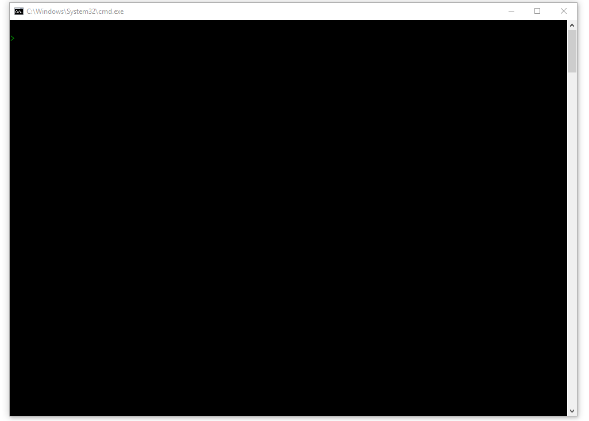

# WBOT
A simple BOT for web.whatsapp

## Preview

## Features

* 🎨 Highly customizable json
* 💯 Totally Free for personal use
* 🔒 Complete Privacy. Your data stays with you always

## Supported Platforms
Following platforms are supported by Wbot:

**macOS**
The minimum version supported is macOS 10.9.

**Windows**
Windows 7 and later are supported

**Linux:**

- Ubuntu 12.04 and later
- Fedora 21
- Debian 8

### Technologies
* [Node](https://nodejs.org/en/)
* [puppeteer](https://github.com/GoogleChrome/puppeteer)

## Why?

The main reason I decided to build this is that I need a simple tool to reply to my "happy birthday" message. I know it is kind of blunt and rude but it would take me 2-3 days to reply to all and by that time that moment would be gone. I just need a good solution to this problem. I really don't need a full-fledged AI-BOT or BOT with NLU (or some other acronym). I believe there are many people who also have such need.

## Goals
With that in mind, I know that WBOT would need to satisfy these criteria:

* 🚀 Fast!!!
* 👍 Friendly CLI UX
* 🔒 Does not touch user’s data
* 💰 Free! for personal use

If you think WBOT delivers these, let me know by putting a star on this project 😉

## FAQ

* **Is this app built with NodeJS?**

Yes, it's built with [NodeJS](https://nodejs.org/en/). Please see the [Technologies](#technologies) section for more info.

* **What boilerplate did you use**

None. The idea was to get a better understanding of how things work together, But I do take a cue from other projects.

* **What npm modules did you use?**

  - [Ora](https://www.npmjs.com/package/ora) for spinner 
  - [cli-progress](https://www.npmjs.com/package/cli-progress) for download progress bar in terminal
  - [qrcode-terminal](https://www.npmjs.com/package/qrcode-terminal) to generate QRCode in terminal 

* **Apart from development, what else do you do?**

I do motion design and UI/UX development.

* **Are you available for hire?**

I have a full-time job as a software developer here at technobrains.net. I am available as a freelance consultant during my spare time please let me know what you have in mind.

* **How do I contact you?**

If you find an issue, please report it here. For everything else, please drop me a line at vasani.arpit@gmail.com